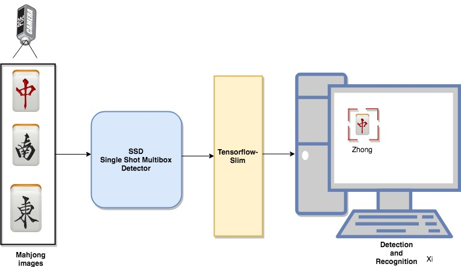
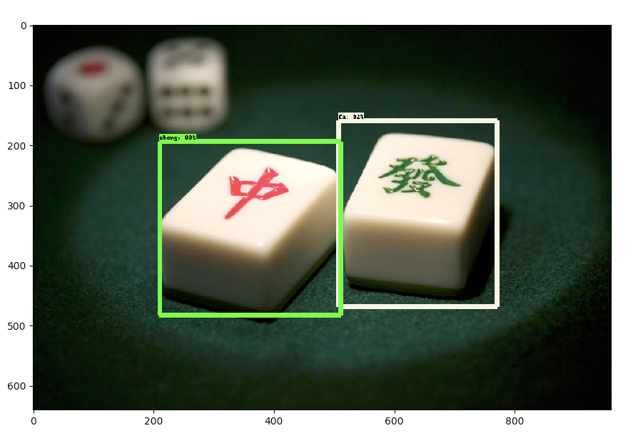

### This program trains SSD (Single Shot Multibox Detector)algorithm on mahjong images for markers detection and tracking

### Table of Contents
1. [Architecture](#Architecture)
2. [Preparing the image dataset](#Training)
3. [Training the images with SSD-inceptionv2 model](#Training)
3. [Run detection and recognition on image](#third-example)

### 1- Architecture


 
### 2- Preparing the image dataset

***DATASET***


#### 2.1 Saving image from a video file
A video recording of mahjong dices was performed. To save image frames, the following python script was used:
```
python3 save_frame.py
```
#### 2.2 Image renaming

##### Use the following command to rename the images contained in the dataset

```
find . -name '*.jpg' | gawk 'BEGIN{ a=1 }{ printf "mv \"%s\" %04d.jpg\n", $0, a++ }' | bash
```
#### 2.3 Images annotation and labeling   using LabelImg tool
Clone this repository: git clone https://github.com/tzutalin/labelImg.git

***For python 3.5***

```
$ sudo apt install python3-lxml pyqt5-dev-tools cmake
$ make qt5py3
$ python3 labelImg.py
```
#### 3- Training the images with SSD-inceptionv2 model
#### 3.1 Create tensorflow record
```
python3 create_pascal_tf_record.py \
    --label_map_path=~/object_detection/data/mscoco_label_map.pbtxt \
    --data_dir=~/slim/VOCdevkit/ --year=VOC2007 --set=train \
    --output_path=mscoco_train.record
```
#### 3.2 Training phase
```
python3 object_detection/train.py \
    --logtostderr \
    --pipeline_config_path=~/object_detection/samples/configs/ ssd_inception_v2_coco.config \
    --train_dir=~/slim/coco_inceptionv2
```
#### 3.3 Exporting the inference graph 
```
CHECKPOINT_NUMBER=60000
python3 export_inference_graph.py --input_type image_tensor --pipeline_config_path ~/object_detection/sampleconfigs/ssd_inception_v2_coco.config --trained_checkpoint_prefix ~/object_detection/model.ckpt-${CHECKPOINT_NUMBER} --output_directory ~/object_detection/ output_inference_graph.pb
```

#### 4- Run detection and recognition on image
```
$ python3 ssd_coco_detection.py
```
#### Result

 <p align="center">
  
</p>


